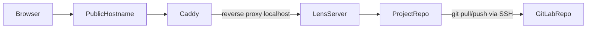

# Lens Deployment Design

## 1. Purpose

This document defines Milestone 4: Deployment, Serving & Security for the Lens web app.

The deployment model is intentionally narrow:

- single user
- personal use
- deployed manually from a local machine
- no CI
- no multi-user auth model
- no scaling or hardening roadmap in scope for this milestone

The design has two target operating modes:

1. the minimum: run Lens on the user's local machine, expose it externally with dynamic DNS, HTTPS, and Basic Auth
2. the goal: run Lens on Fly.io as a single-machine deployment with one mounted repo volume

## 2. Goals And Constraints

Milestone 4 must preserve the current architecture described in `docs/api-design.md` and `docs/app-design.md`:

- `lens serve` remains the production entrypoint
- the frontend is built and served from the same origin as the API
- the server operates against one Lens project for its whole lifetime
- the server assumes a real git-backed Lens project
- Caddy remains the outer security boundary

The deployment design must satisfy these constraints:

1. Deploy from a local machine.
2. Build the current Lens code and UI before release.
3. Package the full Lens repo into the deployed runtime, including bundled datasets such as `datasets/dnd/`.
4. Keep the mutable project repo separate from the Lens application code.
5. Clone and push the project repo over SSH using a separate GitLab identity from the Lens code repo.
6. Inject LLM secrets only through environment variables referenced by `lens.toml`.
7. Support Caddy HTTPS plus Basic Auth.
8. Support custom domains.
9. Stay simple enough that running directly on the user's home machine is a legitimate baseline.

## 3. Chosen Baseline

This milestone does not need a broad hosting comparison anymore.

Instead, the design is:

- minimum viable deployment: local machine + dynamic DNS + Caddy + external access
- target deployment: Fly.io single machine + mounted volume + the same Caddy/Lens model

This keeps the architecture coherent:

- same server entrypoint
- same same-origin UI/API model
- same Basic Auth boundary
- same project repo semantics

Only the host changes.

## 4. Shared Runtime Model

Both deployment modes share the same runtime topology.



Core rules:

- Caddy is the only public entrypoint.
- Lens binds only to localhost behind Caddy.
- The project repo is a real git working tree.
- Lens code and bundled datasets are part of the application runtime, not the project repo.

## 5. Lens Application Payload

Any non-local deployment must ship the full Lens repo, not just the server package.

Reason:

- bundled datasets such as `datasets/dnd/` live in the Lens codebase
- the web app must be able to read those datasets at runtime
- the project repo is separate and mutable; datasets are part of the immutable app payload

So the deployed runtime always has two layers:

- application layer: Lens Python code, built UI assets, bundled datasets, Caddy config/templates, runtime scripts
- project layer: the mutable Lens project repo

The local-machine setup already has this naturally because it is running from the local Lens checkout. The Fly deployment must package it explicitly into the image.

## 6. The Minimum: Local Machine With Dynamic DNS

### Why This Is The Minimum

This is the shortest path from the current development model to a usable personal deployment.

Today, you can already:

- run `lens serve`
- bind to `0.0.0.0`
- reach it from devices on your local network

The missing pieces are:

- stable external hostname
- valid TLS certificate
- Basic Auth credentials
- router/network setup for inbound access

So the minimum deployment is not a new platform. It is the current app with internet-facing infrastructure on top.

### Shape

- Lens runs on the local machine
- Caddy runs on the local machine
- the Lens project repo is on the local machine
- dynamic DNS points a hostname at the home network
- the router forwards HTTPS traffic to Caddy

### Runtime

Recommended process model:

- Caddy listens publicly on `:443`
- Lens serves only on `127.0.0.1:<port>`
- Caddy reverse-proxies to Lens

Example conceptual flow:

1. phone/browser hits `lens.example.net`
2. dynamic DNS resolves to home IP
3. router forwards `443` to the machine
4. Caddy terminates TLS and enforces Basic Auth
5. Caddy proxies to local `lens serve`

### Security Requirements

Minimum security boundary:

- HTTPS only
- Caddy `basic_auth`
- Lens not publicly bound directly

Rules:

- do not expose the Lens port directly to the internet
- do not rely on obscurity or LAN-only assumptions
- use a real password, hashed in Caddy config
- keep the repo and LLM secrets only on the local machine environment

### Dynamic DNS And Certificate Setup

The local-machine path needs:

1. a hostname under a domain you control, or a dynamic-DNS provider hostname
2. automatic updating of that hostname as your home IP changes
3. Caddy configured for that hostname so it can obtain and renew certificates
4. router/NAT forwarding for HTTPS

This is enough for the minimum deployment. No special Lens code is needed.

### Advantages

- lowest complexity
- lowest implementation effort
- no image packaging or cloud-specific bootstrap needed
- easiest way to verify the overall security and UX model

### Trade-Offs

- depends on the local machine being on
- depends on home networking and router configuration
- weaker isolation than a dedicated remote host
- operational reliability is whatever the home machine provides

### When To Prefer It

Use the local-machine path when:

- the app is used occasionally
- home networking is acceptable
- "good enough external access" matters more than host independence
- you want the fastest route to personal remote access

## 7. The Goal: Fly Single Machine

### Why Fly Remains The Goal

Fly gives a cleaner "personal server" shape without introducing a large ops surface:

- one public app
- one machine
- one mounted volume
- straightforward HTTPS/domain handling
- no need to keep the home machine on

This is the right target once you want the app available independently of the local machine.

### Shape

- one Fly app
- one machine
- one volume mounted at a persistent path such as `/data`
- one region
- Caddy and Lens in the same runtime image

### Project Repo Layout

Recommended volume layout:

```text
/data/
  repo/
    .git/
    lens.toml
    narrative/
    knowledge/
```

Rules:

- `/data/repo` is the canonical server-side working copy
- the application image must never overwrite `/data/repo`
- Lens starts against `/data/repo`

### Bootstrap And Updates

First deployment:

1. deploy image containing Lens code, built UI, and bundled datasets
2. materialize secrets and SSH config
3. clone the GitLab project repo into `/data/repo`
4. validate that it is a Lens project
5. start Lens behind Caddy

Later deploys:

- keep `/data/repo`
- replace only the application image
- do not reclone
- do not overwrite local uncheckpointed work

### Refresh Behavior

This milestone should assume a simple refresh model.

If the project changes elsewhere and the server needs to pull:

- add a `lens refresh` command
- it runs a conservative `git pull` or equivalent fetch + fast-forward flow against the configured branch
- if the server repo has local uncommitted changes, refresh should fail rather than merge automatically

This is intentionally simple:

- no branches
- no conflict workflows
- no automatic merge resolution
- "my headache if I do that" is the right operating assumption for this milestone

### Volume Durability And `lens checkpoint`

Important Fly-specific clarification:

- stopping or suspending a machine does not discard Fly Volume data
- redeploying the image does not discard Fly Volume data
- volume data persists across restart, redeploy, and suspend/resume

But:

- a Fly Volume is still tied to a single machine and underlying host
- automatic snapshots are recovery help, not the primary semantic durability boundary

So `lens checkpoint` still matters.

Its role is not:

- "keep my repo alive across suspend"

Its real role is:

- push meaningful work to GitLab so the project state exists off-host

The right mental model is:

- Fly volume keeps the server-side working tree durable for ordinary operations
- GitLab is the primary durable copy of meaningful progress
- snapshots are disaster-recovery support

### Cost Modes

For Fly, the real decision is between two modes:

1. cheaper mode: `auto_stop_machines = "suspend"` and `min_machines_running = 0`
2. warmer mode: `min_machines_running = 1`

Interpretation:

- suspended mode minimizes compute cost and accepts first-request wake latency
- `min_machines_running = 1` pays continuous compute to avoid that wake-up penalty

Once you prefer always-warm behavior, the economic comparison becomes:

- Fly always-on single machine
- versus just running the service on your own local machine

That is the right re-baselined comparison. The point is no longer "Fly versus many cloud options"; it is "independent remote availability versus home-host convenience."

### When To Prefer It

Use Fly when:

- you want the app available even when the local machine is off
- you want cleaner public hosting than home-network exposure
- a single-machine, single-user model is still sufficient

## 8. Git Access Model

The project repo is separate from the Lens code repo and uses a separate GitLab identity boundary.

Use:

- one GitLab deploy key
- scoped to the project repo only
- with write access

Do not use:

- the user's personal GitLab SSH key
- Lens repo credentials
- shared multi-repo keys

Runtime requirements:

- the private key is injected as a secret
- it is written to an ephemeral runtime path
- permissions are strict
- `known_hosts` is pinned for `gitlab.com`
- `StrictHostKeyChecking yes` is required

Recommended SSH shape:

```text
Host gitlab.com
  HostName gitlab.com
  User git
  IdentityFile /run/secrets/gitlab_deploy_key
  IdentitiesOnly yes
  StrictHostKeyChecking yes
  UserKnownHostsFile /run/secrets/known_hosts
```

Branch policy for this milestone:

- one primary branch
- no rebases
- no force pushes
- no automatic conflict handling

## 9. Secrets

### LLM Secrets

The current `lens/core/llm.py` model stays exactly the same:

- `lens.toml` stores env-var names
- actual secret values come from runtime environment variables

Deployment behavior must:

1. read `lens.toml`
2. collect required `api_key_env` names
3. fail if any required secret is missing

## 10. Caddy And Public Access

Caddy remains the primary security layer in both deployment modes.

Responsibilities:

- terminate HTTPS
- manage certificates
- enforce Basic Auth
- reverse proxy to Lens on localhost

Lens responsibilities:

- serve the UI and API
- trust that any request reaching it is already authenticated
- never be the public-facing listener

### Basic Auth

The password can be provided during setup and converted into a Caddy-supported hash.

Rules:

- store the hash, not plaintext
- make credential rotation a rerun of the setup/update flow
- keep the username explicit

### SSE

This architecture remains valid for streaming:

- browser-authenticated SSE works naturally behind Basic Auth
- no token system is needed
- Caddy must not be configured in a way that buffers SSE responses incorrectly

### Custom Domains

Both deployment modes support custom domains.

Local-machine mode:

- point the chosen hostname at the home IP via dynamic DNS
- configure Caddy for that hostname
- forward `443` from the router to the host

Fly mode:

- assign a hostname such as `lens.example.com`
- attach/configure the hostname on the Fly app
- update DNS per Fly's setup instructions
- let Caddy continue to act as the in-app auth and reverse-proxy layer

## 11. CLI Route And Subprocess Model

The current web CLI route in `lens/server/routes/cli.py` runs Lens commands by spawning:

- Python subprocesses
- `git` subprocesses as needed

This is acceptable for both deployment modes.

Implications:

- Python must be present in the runtime
- `git` must be present in the runtime
- the process must have access to the working tree
- only one active command at a time is the intended mode

This is not a blocker. It just means the deployment runtime should be practical rather than ultra-minimal.
