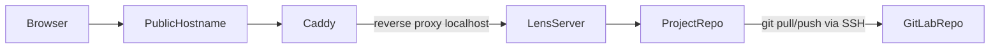

# Lens Deployment Design

## 1. Purpose

This document defines Deployment, Serving & Security for the Lens web app.

The deployment model is intentionally narrow:

- single user
- personal use
- deployed manually from a local machine
- no CI
- no multi-user auth model
- no scaling or hardening roadmap in scope for this milestone

The design has two target operating modes:

1. the minimum: run Lens on the user's local machine, expose it externally with dynamic DNS, HTTPS, and Basic Auth
2. the goal: run Lens on Fly.io as a single-machine deployment with one mounted repo volume

## 2. Goals And Constraints

Must preserve the current architecture described in `docs/api-design.md` and `docs/app-design.md`:

- `lens serve` remains the production entrypoint
- the frontend is built and served from the same origin as the API
- the server operates against one Lens project for its whole lifetime
- the server assumes a real git-backed Lens project
- Caddy remains the outer security boundary

The deployment design must satisfy these constraints:

1. Deploy from a local machine.
2. Build the current Lens code and UI before release.
3. Package the full Lens repo into the deployed runtime, including ALL bundled datasets (`datasets/rpg/`, `datasets/dnd/`, etc.).
4. Keep the mutable project repo separate from the Lens application code.
5. Clone and push the project repo over SSH using a separate GitLab identity from the Lens code repo.
6. Inject LLM secrets only through environment variables referenced by `lens.toml`.
7. Support Caddy HTTPS plus Basic Auth.
8. Support custom domains.
9. Stay simple enough that running directly on the user's home machine is a legitimate baseline.

## 3. Baseline

We have two modalities:

- minimum viable deployment: local machine + dynamic DNS + Caddy + external access
- target deployment: Fly.io single machine + mounted volume + the same Caddy/Lens model

This keeps the architecture coherent:

- same server entrypoint
- same same-origin UI/API model
- same Basic Auth boundary
- same project repo semantics

Only the host changes.

## 4. Shared Runtime Model

Both deployment modes share the same runtime topology.



Core rules:

- Caddy is the only public entrypoint.
- Lens binds only to localhost behind Caddy.
- The project repo is a real git working tree.
- Lens code and bundled datasets are part of the application runtime, not the project repo.

## 5. Lens Application Payload

Any non-local deployment must ship the full Lens repo, not just the server package.

Reason:

- bundled datasets such as `datasets/rpg/` and `datasets/dnd/` live in the Lens codebase
- the web app must be able to read those datasets at runtime (like we do no by running `lens serve` from the project repo)
- the project repo is separate and mutable; datasets are part of the immutable app payload

So the deployed runtime always has two layers:

- application layer: Lens Python code, built UI assets, bundled datasets, Caddy config/templates, runtime scripts
- project layer: the mutable Lens project repo

The local-machine setup already has this naturally because it is running from the local Lens checkout. The Fly deployment must package it explicitly into the image.

## 6. The Minimum: Local Machine With Dynamic DNS

### Why This Is The Minimum

Today, we can already:

- run `lens serve`
- bind to `0.0.0.0`
- reach it from devices on your local network
- use dynamic DNS for stable external hostname
- leverage valid TLS certificate
- enforce Basic Auth credentials
- manual router/network setup for inbound access

### Shape

- Lens runs on the local machine
- Caddy runs on the local machine
- the Lens project repo is on the local machine
- dynamic DNS points a hostname at the home network
- the router forwards HTTPS traffic to Caddy

### Runtime:

- Caddy listens on a public port (e.g. `:443` with sudo/setcap, or a high port such as `:8443` with the router forwarding 443 to it)
- Lens serves only on `127.0.0.1:<port>`
- Caddy reverse-proxies to Lens

Flow: browser hits the hostname; dynamic DNS resolves to home IP; router forwards 443 to the machine; Caddy terminates TLS and Basic Auth, then proxies to local `lens serve`.

### Security Requirements

Minimum security boundary:

- HTTPS only
- Caddy `basic_auth`
- Lens not publicly bound directly

Rules:

- do not expose the Lens port directly to the internet
- do not rely on obscurity or LAN-only assumptions
- use a real password, hashed in Caddy config
- keep the repo and LLM secrets only on the local machine environment

### Dynamic DNS And Certificate Setup

The local-machine path needs:

1. a hostname under a domain you control, or a dynamic-DNS provider hostname
2. automatic updating of that hostname as your home IP changes
3. Caddy configured for that hostname so it can obtain and renew certificates
4. router/NAT forwarding for HTTPS

This is enough for the minimum deployment. No special Lens code is needed.

### Advantages

- lowest complexity
- lowest implementation effort
- no image packaging or cloud-specific bootstrap needed
- easiest way to verify the overall security and UX model

### Trade-Offs

- depends on the local machine being on
- depends on home networking and router configuration
- weaker isolation than a dedicated remote host
- operational reliability is whatever the home machine provides

### When To Prefer It

Use the local-machine path when:

- the app is used occasionally
- home networking is acceptable
- "good enough external access" matters more than host independence
- you want the fastest route to personal remote access

### Reference: Concrete Local Setup (One Machine)

The following was used to get the minimum deployment working on a single home machine. Details are environment-specific but reproducible.

**Caddy build.** Caddy was built with:

- [dynamic_dns](https://caddyserver.com/docs/modules/dynamic_dns) (e.g. [mholt/caddy-dynamicdns](https://github.com/mholt/caddy-dynamicdns))
- [dns.providers.cloudflare](https://github.com/caddy-dns/cloudflare)

so that one binary handles both dynamic DNS (A record for the hostname) and ACME DNS-01 for TLS. A single Cloudflare API token with `Zone.Zone:Read` and `Zone.DNS:Edit` is used for both and stored in ENV `CF_API_TOKEN`.

**Caddyfile shape.** Caddy runs as the current user (no root) and listens on a high port (e.g. `8443`) to avoid privileged ports. 

```
{
	email me@example.com

	dynamic_dns {
		provider cloudflare {env.CF_API_TOKEN}
		domains {
			example.com lens
		}
		ip_source simple_http https://icanhazip.com
		check_interval 5m
		versions ipv4
		ttl 1h
	}
}

lens.example.com:8443 {
	bind 0.0.0.0
	encode gzip zstd
	basic_auth {
		user <hash from caddy hash-password --plaintext 'your-password'>
	}
	tls {
		dns cloudflare {env.CF_API_TOKEN}
		resolvers 1.1.1.1
	}
	reverse_proxy 127.0.0.1:8000
}
```

**Router.** One port-forward rule: external TCP 443 → same machine’s LAN IP, internal port 8443. The host’s LAN IP is fixed (DHCP reservation or static). Clients use `https://lens.example.com` (port 443); they never see 8443.

**Processes.** Lens runs first (`lens serve`, bound to `127.0.0.1:8000`). Caddy is started in the same environment so `CF_API_TOKEN` is set. No sudo; Caddy does not bind 443 on the host.

## 7. The Goal: Fly Single Machine

**Why Fly.** One app, one machine, one mounted volume; straightforward HTTPS and no dependency on the home machine being on. Use when you want the app available off-host or cleaner public hosting than home-network exposure.

**Shape.** One Fly app, one machine, one volume at e.g. `/data`. Caddy and Lens live in the same image; the project repo lives on the volume.

**Volume layout.** `/data/repo/` is the canonical working copy (`.git/`, `lens.toml`, `narrative/`, `knowledge/`). The image must never overwrite it; Lens starts against `/data/repo`. Bootstrap: deploy image, inject secrets and SSH config, clone project repo into `/data/repo`, validate, start Lens behind Caddy. Later deploys replace only the image; do not reclone or overwrite uncheckpointed work.

**Refresh.** The `lens refresh` command runs a conservative `git pull` (or fetch + fast-forward); if the server has local uncommitted changes, refresh fails. No automatic merge. One primary branch, no rebases/force-pushes.

**Durability.** Fly volume data survives restart, redeploy, suspend/resume. The volume is still tied to one machine; snapshots are recovery help. GitLab is the primary durable copy; `lens checkpoint` exists to push work off-host. Use Fly volume for normal durability, GitLab for meaningful progress, snapshots for disaster recovery.

**Cost.** Either suspend when idle (`min_machines_running = 0`) and accept wake latency, or keep one machine running. The comparison is “remote availability vs. home-host convenience,” not Fly vs. many clouds. User configurable.

## 8. Git Access Model

The project repo is separate from the Lens code repo and uses a separate GitLab identity boundary.

Use:

- one GitLab deploy key (provided as a secret)
- scoped to the project repo only
- with write access

Do not use:

- the user's personal GitLab SSH key
- Lens repo credentials
- shared multi-repo keys

Runtime requirements:

- the private key (like all other secrets, like S3 creds) is injected as a secret (using `fly secrets`)
- it is written to an ephemeral runtime path
- permissions are strict
- `known_hosts` is pinned for `gitlab.com`
- `StrictHostKeyChecking yes` is required

Recommended SSH shape:

```text
Host gitlab.com
  HostName gitlab.com
  User git
  IdentityFile /run/secrets/gitlab_deploy_key
  IdentitiesOnly yes
  StrictHostKeyChecking yes
  UserKnownHostsFile /run/secrets/known_hosts
```

Branch policy for this milestone:

- one primary branch
- no rebases
- no force pushes
- no automatic conflict handling

## 9. Secrets

Use `fly secrets` (that means we need a `fly.toml`... in the lens repo or in the project?)

### LLM Secrets

The current `lens/core/llm.py` model stays exactly the same:

- `lens.toml` stores env-var names (unless assumed like git or AWS vars)
- actual secret values come from runtime environment variables

Deployment behavior must:

1. read `lens.toml`
2. collect required `api_key_env` names (have user place them in current env)
3. fail if any required secret is missing

## 10. Caddy And Public Access

Caddy remains the primary security layer in both deployment modes.

Responsibilities:

- terminate HTTPS
- manage certificates
- enforce Basic Auth
- reverse proxy to Lens on localhost

Lens responsibilities:

- serve the UI and API
- trust that any request reaching it is already authenticated
- never be the public-facing listener

### Basic Auth

The password can be provided during setup and converted into a Caddy-supported hash.

Rules:

- store the hash, not plaintext
- make credential rotation a rerun of the setup/update flow
- keep the username explicit

### SSE

This architecture remains valid for streaming:

- browser-authenticated SSE works naturally behind Basic Auth
- no token system is needed
- Caddy must not be configured in a way that buffers SSE responses incorrectly

### Custom Domains

Both deployment modes support custom domains.

Local-machine mode:

- point the chosen hostname at the home IP via dynamic DNS
- configure Caddy for that hostname
- forward `443` from the router to the host

Fly mode:

- assign a hostname such as `lens.example.com`
- attach/configure the hostname on the Fly app
- update DNS per Fly's setup instructions
	- could Caddy keep Cloudflare DNS record pointing to the fly machine like it does for dynamic DNS today?
- let Caddy continue to act as the in-app auth and reverse-proxy layer
