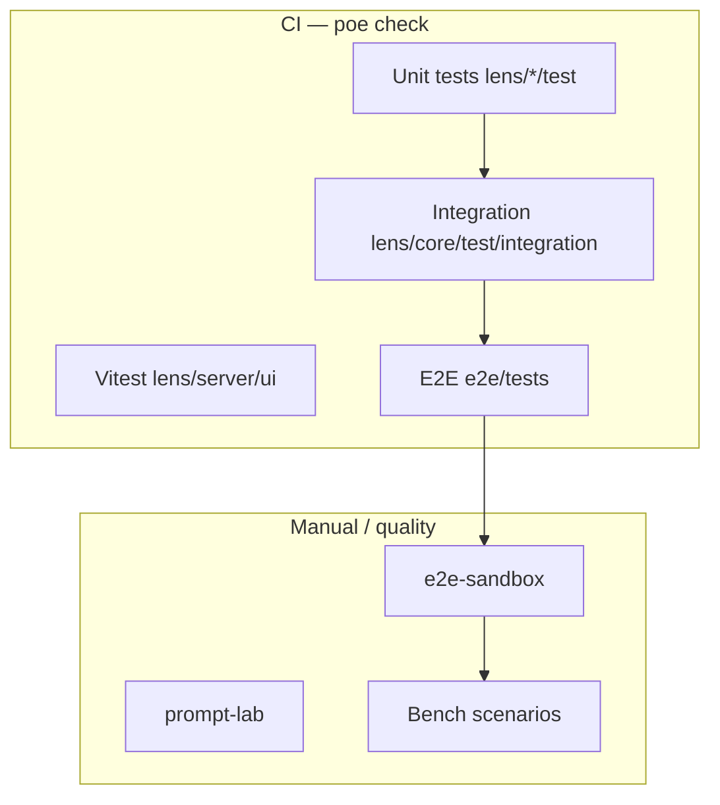

# Testing in Lens

How Lens is verified: fast automated checks in CI, full-stack e2e against a fake LLM, regression fixtures for workflow behavior, a manual UI sandbox, and optional **bench** runs against real models for quality. Project setup and `lens.toml`: **[configuration.md](configuration.md)**.

## Quick reference

| Task | Command |
|------|---------|
| Full CI gate (lint, types, unit, integration, UI unit, build, e2e) | `poe check` |
| Python unit tests (core, cli, server, rpg) | `poe test` |
| Core integration tests | `poe test-integration` |
| End-to-end (API, CLI, Playwright if Chromium installed) | `poe test-e2e` |
| Svelte/Vitest (UI logic) | `poe test-ui` |
| Manual browser sandbox (temp project + fake LLM + server) | `poe e2e-sandbox` |
| Manual sandbox with regression fixture | `poe e2e-sandbox --fixture remember_section` |
| Slow mock streams (cancel / skip / workflow UI) | `poe e2e-sandbox --fixture remember_section --tokens 80 --tps 2` |
| Standalone controllable mock LLM (bench + manual) | `poe mock-llm` |
| **Prompt/KB change: measure the assembled context** | `poe prompt-lab -- --scenario bench/scenarios/<s>.md -o play` |
| Save a prompt-lab baseline, then compare after editing | add `--out /tmp/before`, then `--baseline /tmp/before` |
| Functional quality benchmark (real LLM) | See [bench/README.md](../bench/README.md) |

Run a single test module:

```bash
python -m pytest lens/core/test/test_workflow_runner.py -v
python -m pytest e2e/tests/test_regression_cli.py -n0 -v
```

One-time Playwright dependency for browser e2e:

```bash
playwright install chromium
poe build-ui   # static assets for server-backed UI tests
```

---

## Layers



| Layer | Location | Needs real LLM? |
|-------|----------|-----------------|
| Unit | `lens/core/test`, `lens/cli/test`, `lens/server/test`, `lens/rpg/test` | No |
| UI unit | `lens/server/ui` (Vitest) | No |
| Integration | `lens/core/test/integration` | No |
| E2E | `e2e/tests/` | No (in-process fake LLM) |
| Regression fixtures | `e2e/fixtures/`, `lens/testing/regression_fixtures.py` | No |
| Manual sandbox | `lens/testing/e2e_sandbox.py` | No |
| Prompt lab | `lens/testing/prompt_lab.py` | No (assembles, does not generate) |
| Bench | `bench/scenarios/`, `bench/tools/` | Yes |

---

## Mock LLM (`FakeLLMServer`)

`lens/testing/fake_llm.py` is an in-process **OpenAI-compatible SSE** server used by pytest e2e, `poe e2e-sandbox`, and optionally bench (`llm_mock` profile).

**Default behavior:** Lorem ipsum stream plus `[input:<N>]` (total input character count) so tests can assert context assembly.

**Special triggers** (substring in request messages):

| Trigger | Response |
|---------|----------|
| `EMIT_FAKE_SECRET` | Lorem + `ai:secret:` block (encoding tests) |
| `TEXT TO SUMMARIZE:` | Integration-summary style header + body |
| Remember instruction template marker | Empty unless stream controls apply |

**Stream speed** — in any message text (or server defaults):

```text
tokens=80 tps=2
```

- `tokens` — word count (cycles through Lorem words)
- `tps` — tokens per second (`1/tps` delay between chunks)

```python
from lens.testing.fake_llm import FakeLLMServer

with FakeLLMServer(default_tokens=40, default_tps=5) as llm:
    print(llm.base_url)  # http://127.0.0.1:<port>
```

**Standalone server** (fixed port for bench projects):

```bash
poe mock-llm
# http://127.0.0.1:18765/v1 — see bench/llm_profiles/llm_mock.toml
```

Implementation details: `lens/testing/stream_controls.py`, `bench/tools/mock_llm_server.py`.

---

## Throwaway projects

**`setup_test_project()`** (`lens/testing/project.py`) creates a git repo, `lens.toml` pointing at the fake LLM, KB seeds, optional opening `write`, and returns a `ProjectSession`. Use `datasets=[...]` for bundled RPG/D&D/testing data; `opening_write=False` when a fixture supplies its own prose.

**Regression fixtures** (`lens/testing/regression_fixtures.py`, documented in [e2e/fixtures/README.md](../e2e/fixtures/README.md)) build specific shapes (auto-compress thresholds, remember-at-section-close, play pins, advance fronts subset, long prose for workflow UI).

---

## End-to-end tests (`e2e/`)

Session fixtures in `e2e/conftest.py` chain:

`fake_llm_server` → `lens_project_dir` → `live_server_url` (uvicorn on a free port) → Playwright `base_url`.

| File | Role |
|------|------|
| `test_api_smoke.py` | HTTP smoke (`/health`, narrative tree, node content) |
| `test_cli.py` | CLI subprocesses with `rpg` dataset |
| `test_browser.py` | Playwright UI (edit line picker, transaction diff, write manual, …) |
| `test_regression_cli.py` | CLI+git regression cases (AC-*) |
| `test_regression_browser.py` | Workflow UI (PW-*) |
| `test_bench_regression.py` | Bench scenario file contract smoke |

**External server mode** — point tests at a running dev server instead of spinning up a temp project:

```bash
poe dev   # terminal 1
LENS_DEV_SERVER_URL=http://127.0.0.1:8000 pytest e2e/
```

---

## Manual UI sandbox

`poe e2e-sandbox` mirrors pytest e2e auto mode: temp project, embedded fake LLM, built UI (requires `poe build-ui`), prints a URL like `http://127.0.0.1:<port>/#<slug>/story`.

```bash
poe e2e-sandbox --fixture remember_section --tokens 80 --tps 2
```

- `--fixture` — `remember_section`, `auto_compress_low_threshold`, `workflow_write_long`, `rpg_play_pins`
- `--tokens` / `--tps` — slow streams for **UI runs** only (setup uses `fast_setup()` so startup stays quick)

Human checklists for workflow/regression (SH-*): [e2e/fixtures/SANDBOX_CHECKLIST.md](../e2e/fixtures/SANDBOX_CHECKLIST.md).

---

## Regression plan (1524eaf0 → HEAD)

Automated coverage is split by **lane** (see tests under `e2e/tests/test_regression_*.py` and `lens/core/test/test_regression_workflow.py`):

| Lane | Tooling | Examples |
|------|---------|----------|
| CLI+git | pytest + `FakeLLMServer` | Transactions, auto-compress, `@var` / `@roll` |
| API+SSE | `TestClient` / urllib | Workflow plan, skip remember, skip auto_compress |
| Playwright | Chromium + static UI | Workflow step strip, transaction diff |
| Sandbox-human | `poe e2e-sandbox` + checklist | Skip/cancel wording, remember quality |
| Unit | existing core/server tests | `WorkflowRunner`, remember patches, compress |

Bench quality rubrics (B-01–B-07) are not CI-gated; run when judging model output.

---

## Prompt lab (`poe prompt-lab`)

Editing `lens/prompts/default.toml`, a `design.*` module, a `rules.*` booklet or a `_template` is editing an **LLM prompt**. The diff is not the artifact — the assembled context is, and nothing in the suite asserts on it. `lens/testing/prompt_lab.py` is a sweep over `lens explain` for a project, reporting each prompt's composition: which objects arrived, by which route (pin, `+` expansion, session module, rules companion), and what each costs.

**It owns no content.** The project comes from bench — `setup_bench.py` plus the scenario's own `_setup.sh` — so the material is the datasets and scenarios that are maintained anyway, and a sweep never calcifies observations on a private fixture.

```bash
poe prompt-lab -- --scenario bench/scenarios/play_dnd_rules_split.md -o play
poe prompt-lab -- --scenario bench/scenarios/design_instructions.md -o design
poe prompt-lab -- --project bench/projects/lens_bench_xyz -o play -o design   # reuse a project
poe prompt-lab -- --scenario … -o design -m encounter -m tracker              # open a session first
```

The workflow that makes it worth having:

```bash
poe prompt-lab -- --scenario … -o play --out /tmp/before   # baseline, before you touch anything
#  …edit prompts / modules / templates…
poe prompt-lab -- --scenario … -o play --baseline /tmp/before
```

**What it answers that tests do not:** whether a module is still reachable, whether a `rules.<type>` companion still fires, what a change costs in tokens, and where the budget actually goes.

**Two traps it exists to avoid:**

- **Do not assemble in-process after writing KB objects.** `KnowledgeStore` caches its tag index per project, so a freshly written tag can read stale and a `+` expansion silently resolves to nothing — indistinguishable from a broken feature. Prompt lab shells out to the CLI for every step.
- **A private fixture is content debt.** An earlier cut of this file carried its own campaign inline, which duplicated bench and froze every measurement onto one small arbitrary sample. If a sweep needs material that does not exist, add a bench scenario — that is the layer that owns content.

`lens explain` assembles and measures rather than generating, so a sweep needs no LLM. One is needed only when `--module` asks for a session to be opened first: use the default `llm_mock` profile with `poe mock-llm` running alongside.

---

## Bench (functional quality)

The **bench** system scores operator behavior against **real** LLMs: scenarios, setup scripts, LLM profiles, and HTML/JSON reports.

**Start here:** [bench/README.md](../bench/README.md) (quick start, profiles, directory layout).

**Agent contract:** [bench/agent.md](../bench/agent.md) (required inputs, `lens check`, report tools, when to stop).

**Mock profile for workflow UI** (no API key):

```bash
poe mock-llm
PROJECT=$(python bench/tools/setup_bench.py --profile llm_mock --scenario bench/scenarios/remember_section.md)
export PROJECT && bash bench/scenarios/remember_section_setup.sh
cd "$PROJECT" && lens serve
```

Scenario list and `run_bench_regression.sh` hints: `e2e/fixtures/run_bench_regression.sh`.

---

## Related docs

- [Design](design.md) — transactions, workflow skip vs abort
- [lens/server/README.md](../lens/server/README.md) — SSE routes, `workflow/action`
- [CLAUDE.md](../CLAUDE.md) — agent-oriented command summary and e2e building blocks
